# Todo List 1 - Smart Task Management

## 🌟 Introduction
**Todo List 1** is a powerful API application for task management. This application helps you organize your daily life efficiently by allowing you to add, modify, delete, display all tasks, and display tasks that are due in one day. It also sends email notifications to users about upcoming tasks using Cron, ensuring they never forget about their important tasks.

---

## 📸 Key Features And Screenshots

Since this project is an API-only application, interactions are made through **Postman**.

### 1. Signup Page
User Signup page with user_name, email, and password authentication.
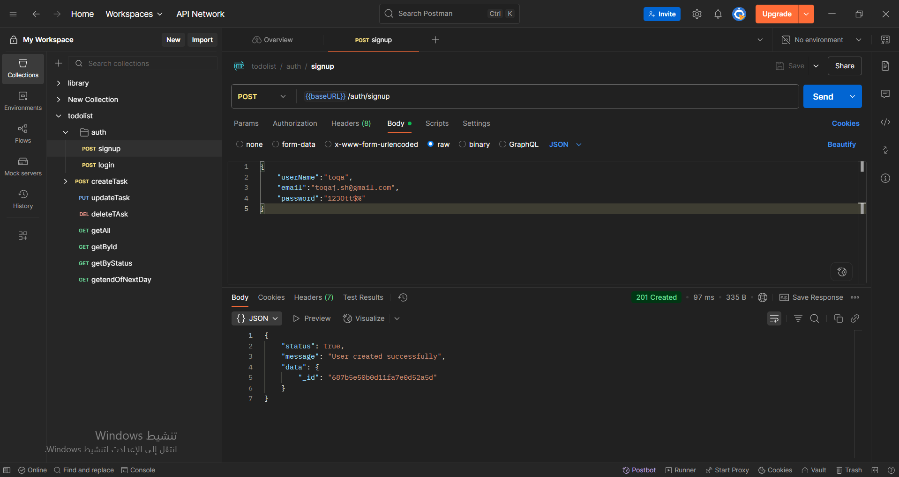
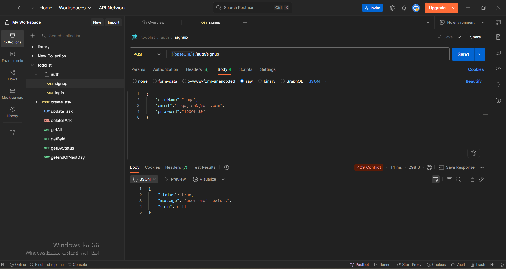

### 2. Login Page
User login page with email and password authentication.
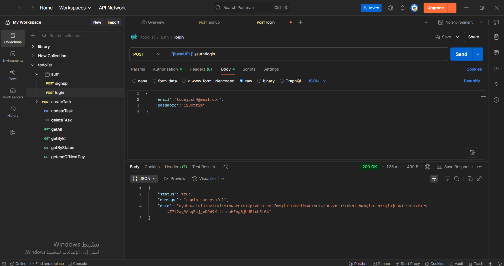
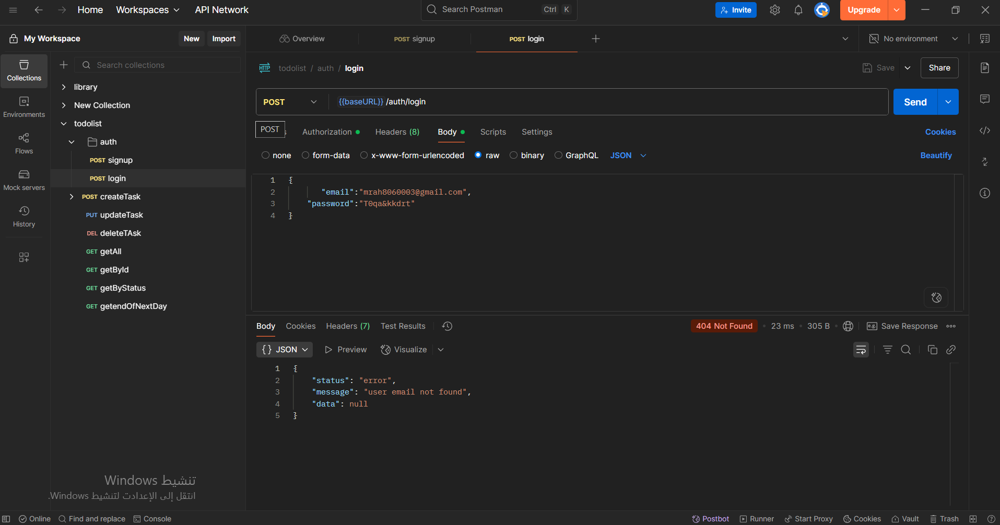
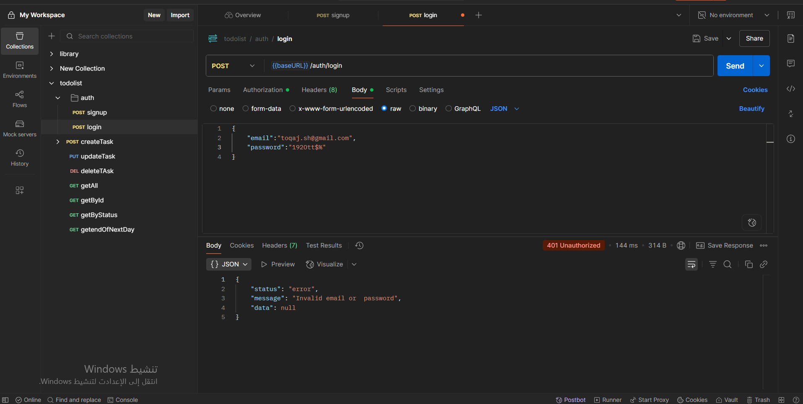

### 3. Add New Task
The process of adding a new task via the API, with logged-in user.
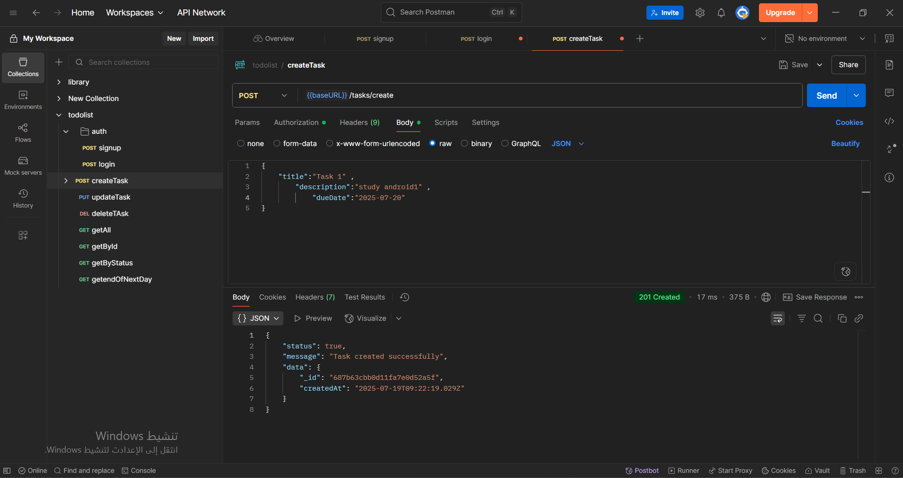
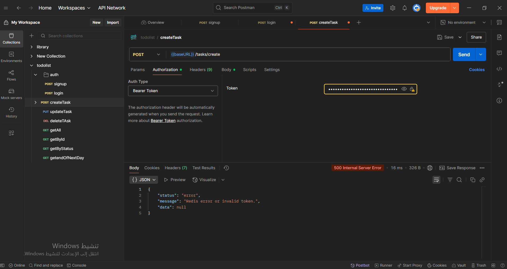

### 4. Update Task
The process of updating a task by ID via the API, with logged-in user.
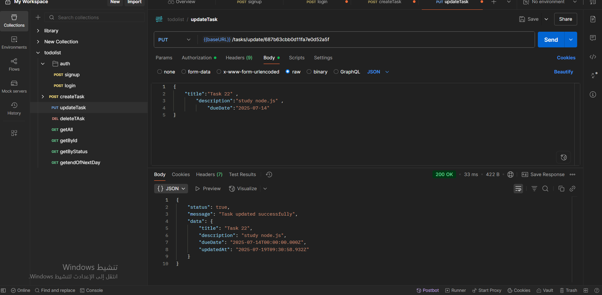
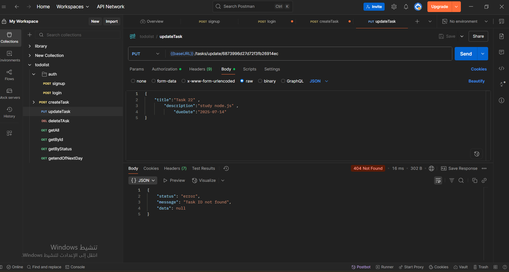

### 5. Delete Task
The process of deleting a task by ID via the API, with logged-in user.
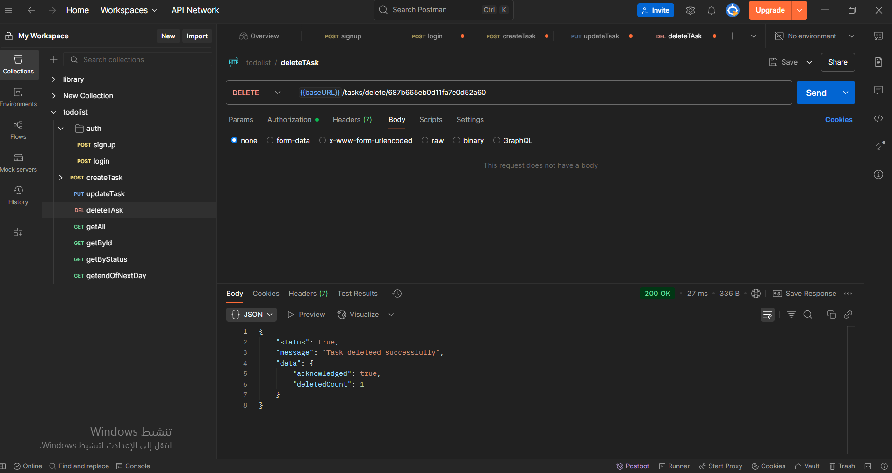
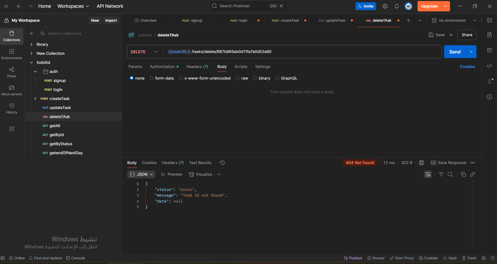

### 6. Get All Tasks
The process of getting all tasks via the API, with logged-in user.
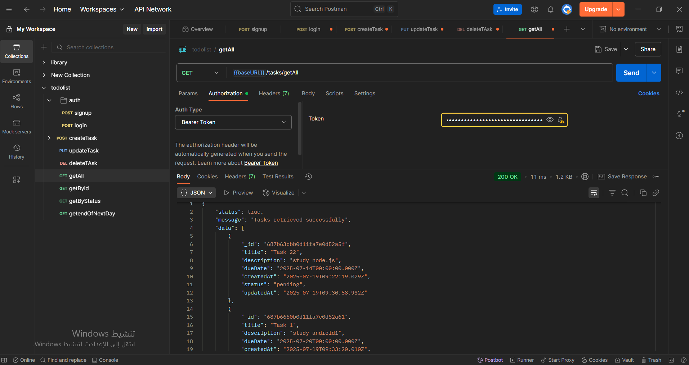
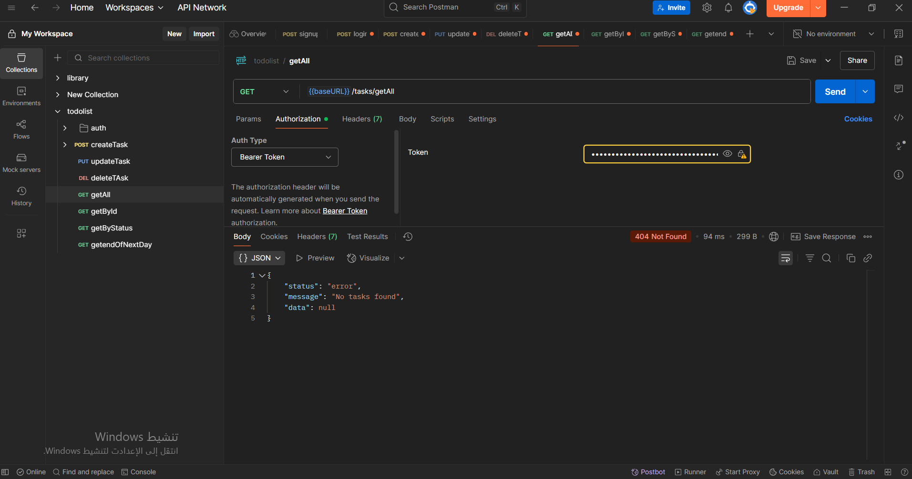

### 7. Get Task By ID
The process of getting a task by ID via the API, with logged-in user.
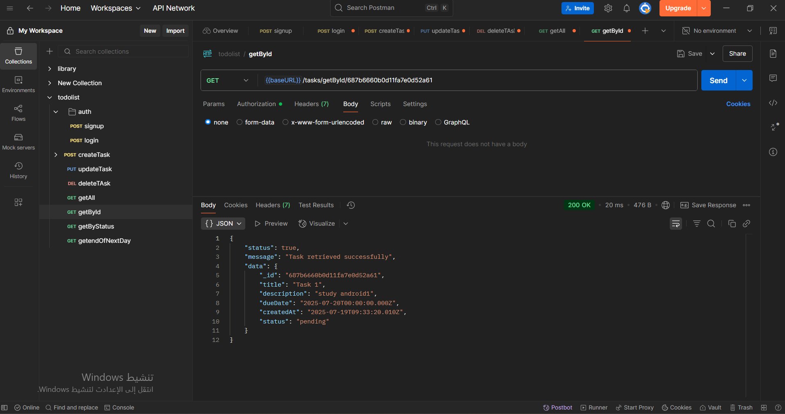
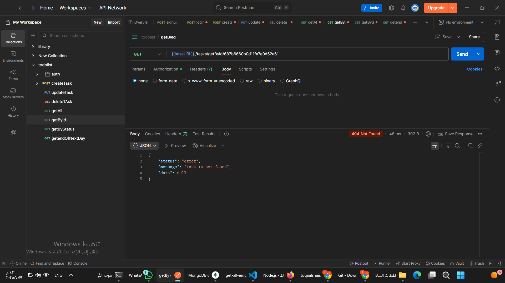

### 8. Get Tasks By Status
The process of getting tasks by status via the API, with logged-in user.
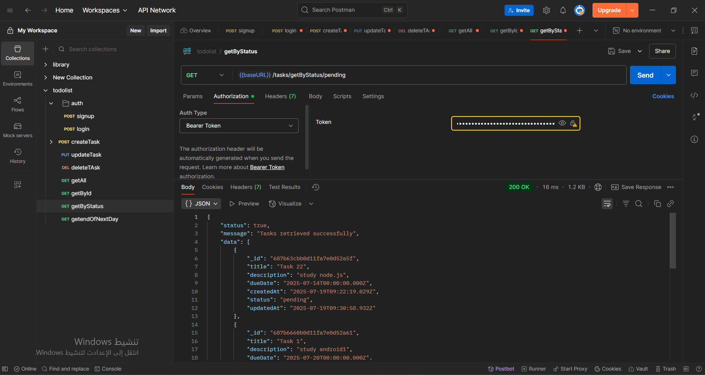
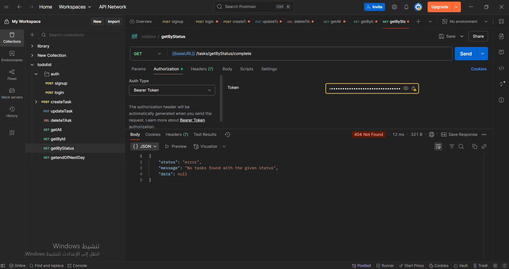

### 9. Get All Tasks That End Next Day
The process of getting all tasks that end the next day via the API, with logged-in user.

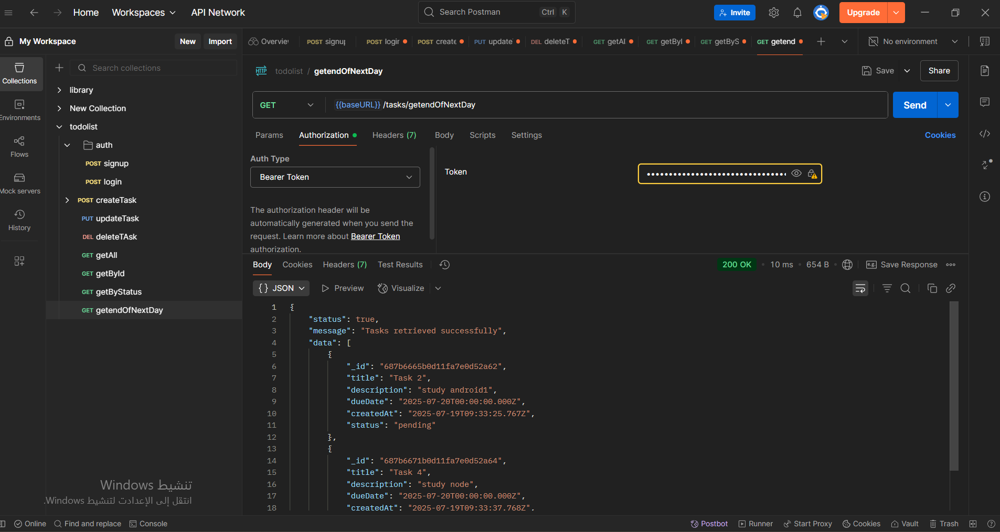

### 10. Send Email For Users With All Tasks That End Next Day
The process of sending an email to users with all tasks that end next day via the API, with logged-in user.
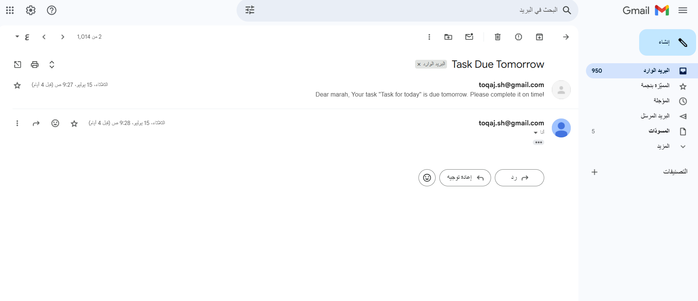

---

## 🛠️ Technologies Used
- **Backend**: Node.js, Express.js
- **Authentication**: JSON Web Tokens (JWT)
- **Database**: MongoDB
- **Security**: bcryptjs
- **Email Sending**: Nodemailer
- **Task Scheduling**: node-cron
- **Input Validation**: @hapi/joi
- **Environment Variables**: dotenv

---

## 🛡️ License
**Todo List 1** is licensed under the [MIT License](https://opensource.org/licenses/MIT).

## ⚙️ Installation and Setup

### 1. Install Node.js
Make sure you have **Node.js** installed on your machine. You can download it from the official website: [https://nodejs.org](https://nodejs.org).

### 2. Clone the Repository
Clone the project to your local machine using Git:

```bash
git clone https://github.com/username/todo-list-1.git
```

### 3. Install Dependencies
Navigate to the project directory and install the required dependencies:

```bash
cd todo-list-1
npm install
```
### 4. Configure Environment Variables
Create a .env file in the root directory and add the necessary environment variables.
Here is an example:
PORT=5000
MONGODB_URI=mongodb://localhost:27017
DATABASE_NAME=todo
JWT_SECRET=your_jwt_secret
EMAIL=youremail.sh@gmail.com
EMAILPASS=foicrkrywgwpubgi


### 5. Run the Application
To start the application, use:

```bash
npm start
```


